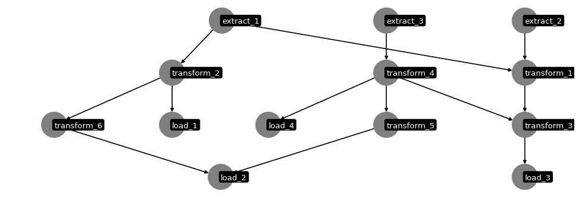
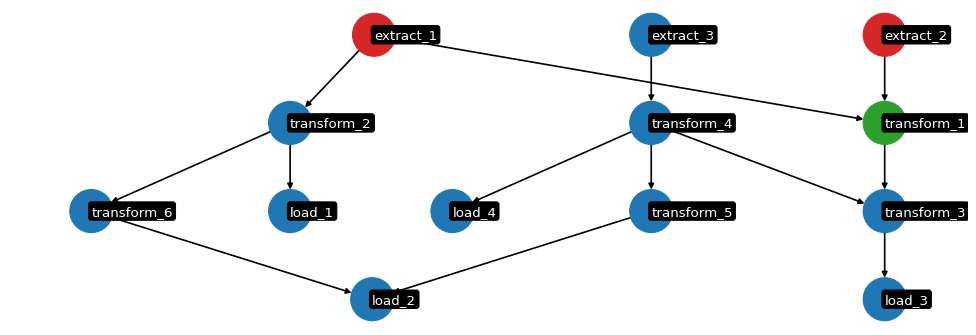

# Data-Pipeline-Tools

Schedule, run and monitor python workflows

Start with a DataFrame of of processes.

Each process requires:
* Process name, ID or equivalent
* What the process depends on. Comma separated for multiple dependencies. 
* Filepath Location of the process script
* The status of the process
* When the process was last run


```python
import pandas as pd

# sample DataFrame spec
schedule_df = pd.read_csv("sample_spec.csv")
schedule_df 
```


<div>
<style scoped>
    .dataframe tbody tr th:only-of-type {
        vertical-align: middle;
    }

    .dataframe tbody tr th {
        vertical-align: top;
    }

    .dataframe thead th {
        text-align: right;
    }
</style>
<table border="1" class="dataframe">
  <thead>
    <tr style="text-align: right;">
      <th></th>
      <th>process</th>
      <th>dep_on</th>
      <th>location</th>
      <th>status</th>
      <th>last_run</th>
    </tr>
  </thead>
  <tbody>
    <tr>
      <th>0</th>
      <td>extract_2</td>
      <td>NaN</td>
      <td>scripts/extract_2.py</td>
      <td>no status</td>
      <td>never</td>
    </tr>
    <tr>
      <th>1</th>
      <td>extract_3</td>
      <td>NaN</td>
      <td>scripts/extract_3.py</td>
      <td>no status</td>
      <td>never</td>
    </tr>
    <tr>
      <th>2</th>
      <td>transform_1</td>
      <td>extract_1,extract_2</td>
      <td>scripts/transform_1.py</td>
      <td>no status</td>
      <td>never</td>
    </tr>
    <tr>
      <th>3</th>
      <td>transform_2</td>
      <td>extract_1</td>
      <td>scripts/transform_2.py</td>
      <td>no status</td>
      <td>never</td>
    </tr>
    <tr>
      <th>4</th>
      <td>transform_3</td>
      <td>transform_1,transform_4</td>
      <td>scripts/transform_3.py</td>
      <td>no status</td>
      <td>never</td>
    </tr>
    <tr>
      <th>5</th>
      <td>transform_4</td>
      <td>extract_3</td>
      <td>scripts/transform_4.py</td>
      <td>no status</td>
      <td>never</td>
    </tr>
    <tr>
      <th>6</th>
      <td>transform_5</td>
      <td>transform_4</td>
      <td>scripts/transform_5.py</td>
      <td>no status</td>
      <td>never</td>
    </tr>
    <tr>
      <th>7</th>
      <td>transform_6</td>
      <td>transform_2</td>
      <td>scripts/transform_6.py</td>
      <td>no status</td>
      <td>never</td>
    </tr>
    <tr>
      <th>8</th>
      <td>extract_1</td>
      <td>NaN</td>
      <td>scripts/extract_1.py</td>
      <td>no status</td>
      <td>never</td>
    </tr>
    <tr>
      <th>9</th>
      <td>load_1</td>
      <td>transform_2</td>
      <td>scripts/load_1.py</td>
      <td>no status</td>
      <td>never</td>
    </tr>
    <tr>
      <th>10</th>
      <td>load_2</td>
      <td>transform_5,transform_6</td>
      <td>scripts/load_2.py</td>
      <td>no status</td>
      <td>never</td>
    </tr>
    <tr>
      <th>11</th>
      <td>load_3</td>
      <td>transform_3</td>
      <td>scripts/load_3.py</td>
      <td>no status</td>
      <td>never</td>
    </tr>
    <tr>
      <th>12</th>
      <td>load_4</td>
      <td>transform_4</td>
      <td>scripts/load_4.py</td>
      <td>no status</td>
      <td>never</td>
    </tr>
  </tbody>
</table>
</div>


```python
from Pipeline import Pipeline

# Create a Pipeline instance using the DataFrame
pipeline = Pipeline(schedule_df,
                    process = "process",
                    dep_on = "dep_on", 
                    location = "location", 
                    status = "status", 
                    last_run="last_run")

# visualise the pipeline
pipeline.draw()
```

    findfont: Font family ['calibri bold'] not found. Falling back to DejaVu Sans.
    


    

    


```python
# Schedule is stored in the object
pipeline.schedule
```


<div>
<style scoped>
    .dataframe tbody tr th:only-of-type {
        vertical-align: middle;
    }

    .dataframe tbody tr th {
        vertical-align: top;
    }

    .dataframe thead th {
        text-align: right;
    }
</style>
<table border="1" class="dataframe">
  <thead>
    <tr style="text-align: right;">
      <th></th>
      <th>process</th>
      <th>dep_on</th>
      <th>location</th>
      <th>status</th>
      <th>last_run</th>
    </tr>
  </thead>
  <tbody>
    <tr>
      <th>0</th>
      <td>extract_2</td>
      <td>NaN</td>
      <td>scripts/extract_2.py</td>
      <td>no status</td>
      <td>never</td>
    </tr>
    <tr>
      <th>1</th>
      <td>extract_3</td>
      <td>NaN</td>
      <td>scripts/extract_3.py</td>
      <td>no status</td>
      <td>never</td>
    </tr>
    <tr>
      <th>2</th>
      <td>transform_1</td>
      <td>extract_1,extract_2</td>
      <td>scripts/transform_1.py</td>
      <td>no status</td>
      <td>never</td>
    </tr>
    <tr>
      <th>3</th>
      <td>transform_2</td>
      <td>extract_1</td>
      <td>scripts/transform_2.py</td>
      <td>no status</td>
      <td>never</td>
    </tr>
    <tr>
      <th>4</th>
      <td>transform_3</td>
      <td>transform_1,transform_4</td>
      <td>scripts/transform_3.py</td>
      <td>no status</td>
      <td>never</td>
    </tr>
    <tr>
      <th>5</th>
      <td>transform_4</td>
      <td>extract_3</td>
      <td>scripts/transform_4.py</td>
      <td>no status</td>
      <td>never</td>
    </tr>
    <tr>
      <th>6</th>
      <td>transform_5</td>
      <td>transform_4</td>
      <td>scripts/transform_5.py</td>
      <td>no status</td>
      <td>never</td>
    </tr>
    <tr>
      <th>7</th>
      <td>transform_6</td>
      <td>transform_2</td>
      <td>scripts/transform_6.py</td>
      <td>no status</td>
      <td>never</td>
    </tr>
    <tr>
      <th>8</th>
      <td>extract_1</td>
      <td>NaN</td>
      <td>scripts/extract_1.py</td>
      <td>no status</td>
      <td>never</td>
    </tr>
    <tr>
      <th>9</th>
      <td>load_1</td>
      <td>transform_2</td>
      <td>scripts/load_1.py</td>
      <td>no status</td>
      <td>never</td>
    </tr>
    <tr>
      <th>10</th>
      <td>load_2</td>
      <td>transform_5,transform_6</td>
      <td>scripts/load_2.py</td>
      <td>no status</td>
      <td>never</td>
    </tr>
    <tr>
      <th>11</th>
      <td>load_3</td>
      <td>transform_3</td>
      <td>scripts/load_3.py</td>
      <td>no status</td>
      <td>never</td>
    </tr>
    <tr>
      <th>12</th>
      <td>load_4</td>
      <td>transform_4</td>
      <td>scripts/load_4.py</td>
      <td>no status</td>
      <td>never</td>
    </tr>
  </tbody>
</table>
</div>


```python
# run the schedule
# the pipeline sorts the process order based on the depenecies automatically
pipeline.execute()
```

    running  extract_1
    running  extract_2
    running  extract_3
    


```python
# we can see the schedule was sorted, the status and last_run were updated as the schedule was executed
pipeline.schedule
```


<div>
<style scoped>
    .dataframe tbody tr th:only-of-type {
        vertical-align: middle;
    }

    .dataframe tbody tr th {
        vertical-align: top;
    }

    .dataframe thead th {
        text-align: right;
    }
</style>
<table border="1" class="dataframe">
  <thead>
    <tr style="text-align: right;">
      <th></th>
      <th>process</th>
      <th>dep_on</th>
      <th>location</th>
      <th>status</th>
      <th>last_run</th>
    </tr>
  </thead>
  <tbody>
    <tr>
      <th>0</th>
      <td>extract_1</td>
      <td>NaN</td>
      <td>scripts/extract_1.py</td>
      <td>error</td>
      <td>never</td>
    </tr>
    <tr>
      <th>1</th>
      <td>extract_2</td>
      <td>NaN</td>
      <td>scripts/extract_2.py</td>
      <td>success</td>
      <td>2022-02-19</td>
    </tr>
    <tr>
      <th>2</th>
      <td>extract_3</td>
      <td>NaN</td>
      <td>scripts/extract_3.py</td>
      <td>error</td>
      <td>never</td>
    </tr>
    <tr>
      <th>3</th>
      <td>transform_2</td>
      <td>extract_1</td>
      <td>scripts/transform_2.py</td>
      <td>dependency failed</td>
      <td>never</td>
    </tr>
    <tr>
      <th>4</th>
      <td>transform_1</td>
      <td>extract_1,extract_2</td>
      <td>scripts/transform_1.py</td>
      <td>dependency failed</td>
      <td>never</td>
    </tr>
    <tr>
      <th>5</th>
      <td>transform_4</td>
      <td>extract_3</td>
      <td>scripts/transform_4.py</td>
      <td>dependency failed</td>
      <td>never</td>
    </tr>
    <tr>
      <th>6</th>
      <td>transform_6</td>
      <td>transform_2</td>
      <td>scripts/transform_6.py</td>
      <td>dependency failed</td>
      <td>never</td>
    </tr>
    <tr>
      <th>7</th>
      <td>load_1</td>
      <td>transform_2</td>
      <td>scripts/load_1.py</td>
      <td>dependency failed</td>
      <td>never</td>
    </tr>
    <tr>
      <th>8</th>
      <td>transform_3</td>
      <td>transform_1,transform_4</td>
      <td>scripts/transform_3.py</td>
      <td>dependency failed</td>
      <td>never</td>
    </tr>
    <tr>
      <th>9</th>
      <td>transform_5</td>
      <td>transform_4</td>
      <td>scripts/transform_5.py</td>
      <td>dependency failed</td>
      <td>never</td>
    </tr>
    <tr>
      <th>10</th>
      <td>load_4</td>
      <td>transform_4</td>
      <td>scripts/load_4.py</td>
      <td>dependency failed</td>
      <td>never</td>
    </tr>
    <tr>
      <th>11</th>
      <td>load_3</td>
      <td>transform_3</td>
      <td>scripts/load_3.py</td>
      <td>dependency failed</td>
      <td>never</td>
    </tr>
    <tr>
      <th>12</th>
      <td>load_2</td>
      <td>transform_5,transform_6</td>
      <td>scripts/load_2.py</td>
      <td>dependency failed</td>
      <td>never</td>
    </tr>
  </tbody>
</table>
</div>


```python
# visualise the pipeline
pipeline.draw()
```


    

    


```python
# errors are captures and stored in a list
pipeline.stderr_list
```


    [b'Traceback (most recent call last):\r\n  File "D:\\repo\\Data-Pipeline-Tools\\scripts\\extract_1.py", line 4, in <module>\r\n    z = x + y + u\r\nNameError: name \'u\' is not defined\r\n',
     b'',
     b"python: can't open file 'D:\\\\repo\\\\Data-Pipeline-Tools\\\\scripts\\\\extract_3.py': [Errno 2] No such file or directory\r\n"]


```python
### Future Enhancements
# group trees and parralel run
# show errors visually
# interactive visual
# networkx.algorithms.dag.is_directed_acyclic_graph
# networkx.algorithms.dag.ancestors
# networkx.algorithms.dag.descendants
```
